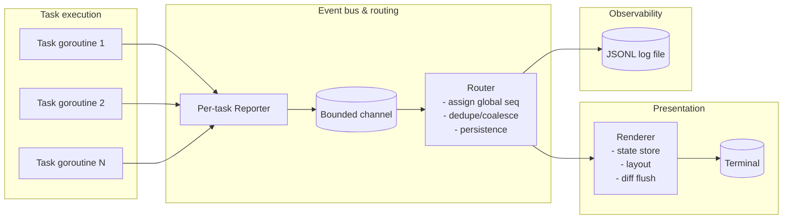
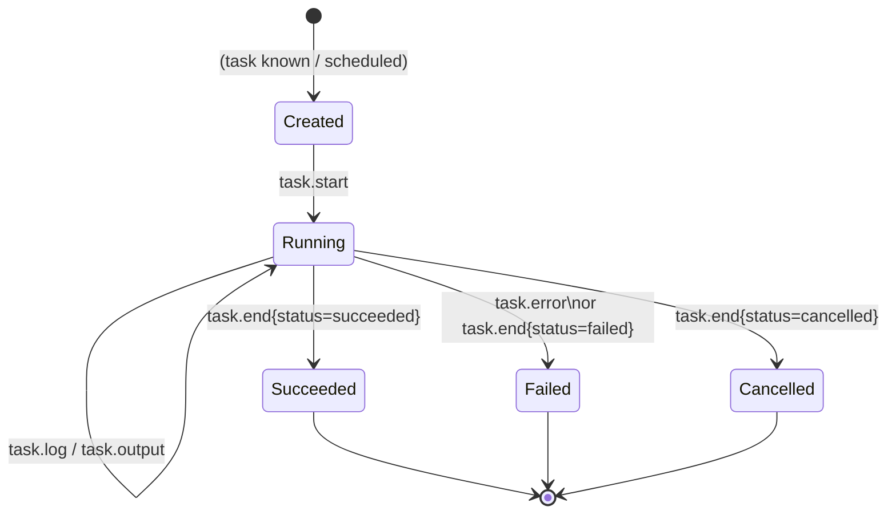

# Designing a JSONL-Driven Terminal Renderer for Parallel Go CLI Tasks

## Executive summary

A robust way to render concurrent task progress “in place” in a terminal is to treat all task updates as an event stream (JSONL/NDJSON) and to centralise *all* terminal writes in a single renderer loop. JSON Lines is explicitly designed for “one record at a time” processing and works well for streaming between cooperating processes and log files. citeturn2search0turn2search5

The recommended architecture is:

- **Workers produce structured events** (`task.start`, `task.progress`, `task.log`, `task.end`, …) instead of printing to the terminal.
- **A message router** assigns a global sequence, optionally persists every event to a JSONL log, applies backpressure/coalescing for high-rate updates, and forwards state changes to the renderer.
- **A renderer is the sole writer to the terminal**, updating fixed “task rows” (or blocks) at a controlled refresh cadence using ANSI/VT control sequences such as cursor positioning (CUP) and erasing (EL/ED), optionally inside the alternate screen buffer to avoid polluting scrollback. citeturn10view0turn10view2turn3search3

Key protocol choices:

- Use **newline-delimited JSON** with a versioned envelope and RFC 3339 timestamps; JSON strings must escape control characters U+0000..U+001F, which includes LF (U+000A), making `\n`-delimited framing safe in practice. citeturn2search0turn15view0turn3search1
- Prefer **renderer-managed layout** (semantic “slots”/regions) over producer-specified absolute coordinates; absolute CUP coordinates are 1-based and fragile under resize/scroll. citeturn10view0turn11view0turn3search3
- For Unicode alignment, compute display width using a wcwidth-style model; East Asian Width and ambiguous-width handling are key pitfalls, and libraries like `go-runewidth` and terminal frameworks like `tcell` provide pragmatic solutions. citeturn4search0turn4search1turn4search34turn13view0

## Problem framing and design goals

The core requirements imply three separations of concern:

- **Task execution vs. presentation:** tasks run in parallel and may finish out of order; the UI must remain responsive even if tasks are slow or chatty.
- **Structured stream vs. terminal control:** your JSONL stream should be a faithful record of what happened (suitable for replay/debugging), while the renderer is free to compress/coalesce updates for smooth terminal output.
- **Terminal UI vs. non-interactive output:** if stdout/stderr is not a terminal, emitting JSONL directly is often preferable to ANSI control sequences; Go provides `IsTerminal` to detect this. citeturn11view0

Two rendering modes are typically useful:

- **Full-screen (alternate screen buffer):** safest positioning model; avoids mixing with shell scrollback; common in TUIs. The xterm family defines `CSI ? 1049 h/l` for entering/leaving the alternate screen buffer. citeturn3search3turn3search11
- **Inline (“sticky” status region):** preserves scrollback and allows interleaved log lines above a fixed progress area; feasible but requires careful cursor/line insertion handling and is more terminal-dependent.

Because terminal support varies across platforms, especially on Windows, rely on the de facto VT/xterm subset and be explicit about enabling VT processing in the Windows console host (`ENABLE_VIRTUAL_TERMINAL_PROCESSING`). citeturn12view0turn12view1

## Library and tooling landscape comparison

The design you choose depends on whether you want to build a minimal renderer (ANSI sequences + your own diffing) or adopt a TUI framework that already provides buffering, resize handling, input events, and Unicode correctness.

| Library / tool | Language | Rendering model | Strengths | Weaknesses / risks | Suitability for JSONL-driven multi-task progress |
|---|---:|---|---|---|---|
| Bubble Tea (framework by entity["company","Charmbracelet","tui tools company"]) | Go | Elm-style TUI loop; supports alt screen and cursor control via commands / options | High-level architecture; built-in terminal control primitives such as entering alt screen and cursor hide/show; good ecosystem for styling and widgets citeturn0search14turn5search4 | Heavier abstraction if you only need “fixed rows”; event ordering and state updates must stay fast (general TUI concern) citeturn5search4 | Strong choice if you want full-screen UI with input handling; JSONL can be your internal event stream feeding the model |
| tcell | Go | Cell-based screen abstraction; manages Unicode width/combining; simulation screen for tests | Low-level but powerful; explicitly supports wide/combining characters and has a `SimulationScreen` for automated tests citeturn13view0 | You build your own layout/widgets; steeper learning curve than high-level frameworks citeturn13view0 | Excellent if you want deterministic diffing and correctness, and you’re comfortable building a renderer around a screen buffer |
| gocui | Go | View/window abstraction with a main loop; supports updating via `Gui.Update` | Simple “views” concept; documentation notes layout runs per event; community patterns for updating via `Gui.Update` citeturn1search7turn1search16 | More limited widget ecosystem; less focus on sophisticated diffing/Unicode than tcell-style approaches citeturn1search7turn13view0 | Good for quick multi-pane CLIs; JSONL events can map naturally to “append to view” and “update status view” |
| termui | Go | Widget/dashboard library (built on termbox-go) | Dashboard-oriented widgets; “takes over your terminal display” model citeturn1search2turn1search6 | Documentation quality varies across versions; termbox lineage implies constraints vs. newer cell engines citeturn1search2turn1search22 | Reasonable if you want dashboards; less ideal for a replayable JSONL event protocol unless you architect it yourself |
| Rich | Python | Live/progress refresh loop; updates at default refresh rates | Mature progress/live components; default refresh rates documented (Progress ~10 Hz; Live ~4 Hz) citeturn2search2turn2search6 | Python ecosystem; not directly reusable in Go | Useful as a reference point for refresh cadence and UX patterns for progress UIs |
| Ratatui | Rust | Double buffer + diffing renderer | Explicitly documents using a double-buffer technique that renders diffs for performance citeturn2search15turn2search27 | Rust; different ecosystem | Excellent conceptual reference for implementing your own diff renderer in Go |
| Ink | Node.js | React renderer; Flexbox via Yoga | Component model; uses Yoga for Flexbox layouts in terminal citeturn5search2turn5search22 | Node.js runtime; React model can be heavyweight | Conceptual reference if you want layout-by-constraints rather than manual coordinates |

image_group{"layout":"carousel","aspect_ratio":"16:9","query":["Bubble Tea TUI example screenshot","tcell Go terminal UI screenshot","Python Rich progress bar screenshot","Ratatui terminal UI demo screenshot"],"num_per_query":1}

## JSONL message schema design for task lifecycles, progress, outputs, and positioning

### Framing and encoding requirements

JSON Lines (newline-delimited JSON) is intended for streaming and logs, and NDJSON additionally specifies `application/x-ndjson` as a media type and recommends `.ndjson` for files. citeturn2search0turn2search5

Framing with `\n` works because JSON strings must escape control characters U+0000..U+001F, which includes line feed; the RFC 8259 string definition explicitly calls out that control characters must be escaped. citeturn15view0turn3search0

Timestamps should use RFC 3339 for interoperability. citeturn3search1

### Schema approach

A practical protocol uses:

- **A stable envelope** with versioning, ordering, identity, and routing metadata.
- **Typed payloads** per event type.
- **A positioning model based on semantic regions/slots**, not raw terminal coordinates, with an escape hatch for absolute coordinates where necessary.

Below are two compatible schema variants:

- **Schema A (recommended):** a single envelope with `type` + `data`.
- **Schema B (high-frequency optimisation):** compact progress messages that omit repeated metadata and rely on prior `task.start` context (useful if you emit thousands of progress events).

#### Schema A: versioned event envelope (recommended)

Field definitions (types are JSON types):

- `v` (number, integer): protocol version, start at `1`.
- `type` (string): event type, e.g. `task.start`.
- `ts` (string): RFC 3339 timestamp.
- `seq` (number, integer): monotonic per-run sequence assigned by the router (global ordering for replay).
- `run` (object):
  - `id` (string): run/session id (UUID/ULID/opaque).
  - `pid` (number, integer, optional): process id if useful.
- `task` (object, optional):
  - `id` (string): stable task id.
  - `name` (string, optional): human name shown in UI.
  - `seq` (number, integer, optional): monotonic per-task event sequence (dedup/out-of-order handling).
- `route` (object, optional):
  - `priority` (string): `low|normal|high` (backpressure decisions).
  - `channel` (string): `ui|log|stdout|stderr|debug`.
- `layout` (object, optional): semantic positioning
  - `region` (string): e.g. `tasks`, `log`, `header`.
  - `slot` (string, optional): stable renderer-assigned slot id (e.g. `tasks/row/3`).
  - `row` (number, integer, optional): 0-based row within region.
  - `col` (number, integer, optional): 0-based col within region.
- `data` (object): type-specific payload.

Event types and payloads:

- `run.start`: `{ "tool": "...", "args": [...], "capabilities": {...} }`
- `task.start`: `{ "status": "running", "meta": {...} }`
- `task.progress`: `{ "fraction": 0.0..1.0, "current": n, "total": n, "unit": "bytes|items|...", "message": "..." }`
- `task.status`: `{ "status": "running|succeeded|failed|cancelled|skipped", "message": "..." }`
- `task.log`: `{ "text": "...", "style": {... optional ...} }` (append-only semantics)
- `task.output`: `{ "stream": "stdout|stderr", "chunk": "...", "encoding": "utf-8|base64", "eof": false }`
- `task.end`: `{ "status": "...", "duration_ms": n, "result": {... optional ...} }`
- `task.error`: `{ "message": "...", "kind": "...", "retryable": true/false, "cause": {... optional ...} }`
- `layout.assign`: `{ "task_id": "...", "region": "tasks", "slot": "tasks/row/3" }` (renderer → producers, optional)
- `renderer.notice`: `{ "dropped": n, "reason": "backpressure", "scope": "task|global" }` (diagnostics)

**Examples (one JSON object per line):**

```json
{"v":1,"type":"run.start","ts":"2026-02-24T11:00:00.000Z","seq":1,"run":{"id":"01HT..."},"route":{"channel":"ui","priority":"high"},"data":{"tool":"mycli","args":["sync"],"capabilities":{"alt_screen":true,"unicode":true}}}
{"v":1,"type":"task.start","ts":"2026-02-24T11:00:00.120Z","seq":2,"run":{"id":"01HT..."},"task":{"id":"t1","name":"Download index","seq":1},"route":{"channel":"ui","priority":"high"},"data":{"status":"running"}}
{"v":1,"type":"task.progress","ts":"2026-02-24T11:00:01.050Z","seq":9,"run":{"id":"01HT..."},"task":{"id":"t1","seq":7},"route":{"channel":"ui","priority":"low"},"data":{"fraction":0.42,"current":420,"total":1000,"unit":"items","message":"Fetching…"}}
{"v":1,"type":"task.log","ts":"2026-02-24T11:00:01.200Z","seq":10,"run":{"id":"01HT..."},"task":{"id":"t1","seq":8},"route":{"channel":"log","priority":"normal"},"data":{"text":"Resolved 18 endpoints"}}
{"v":1,"type":"task.end","ts":"2026-02-24T11:00:03.940Z","seq":21,"run":{"id":"01HT..."},"task":{"id":"t1","seq":15},"route":{"channel":"ui","priority":"high"},"data":{"status":"succeeded","duration_ms":3820}}
```

#### Schema B: compact progress frames (optional)

For high-frequency progress (e.g. 50–200 Hz from many tasks), a compact record can reduce overhead:

- `p` (string): task id
- `s` (number): per-task seq
- `t` (string): RFC3339 timestamp (or omitted if router adds)
- `f` (number): fraction
- `m` (string): message

Example:

```json
{"v":1,"type":"task.p","p":"t1","s":91,"t":"2026-02-24T11:00:01.050Z","f":0.42,"m":"Fetching…"}
```

The router can normalise this into Schema A for persistence/replay.

### Ordering, deduplication, and backpressure semantics

A JSONL stream across goroutines/processes is inherently concurrent: messages can arrive out of order relative to wall-clock time. A pragmatic approach is:

- **Global ordering for replay:** assign `seq` centrally when the router accepts an event.
- **Per-task ordering for state:** maintain `task.seq` and ignore stale updates (if `seq <= lastSeq` for that task).
- **Backpressure policy:** treat progress as “latest wins” and allow coalescing/dropping under load, but never drop lifecycle edges (`task.start`, terminal `task.end`, `task.error`) or log/output records unless explicitly configured; if drops happen, emit `renderer.notice` counters for observability.

This design keeps rendering smooth without losing semantic correctness.

## Terminal layout and coordinate model

### Terminal coordinate primitives

If you implement a renderer directly on ANSI/VT control sequences, your coordinate baseline should reflect standards:

- **CUP (Cursor Position)** in ECMA-48 moves the active presentation position to line `Pn1` and column `Pn2`, with default values 1; in practice this corresponds to the familiar `CSI row;col H` 1-based model. citeturn10view0
- **EL (Erase in Line)** and **ED (Erase in Page/Display)** define the standard “clear” operations used to avoid leaving artefacts when lines shrink. citeturn10view1turn10view2
- **IL/DL (Insert/Delete Line)** exist for in-terminal scrolling region manipulations and can support inline “sticky footer” UIs, but behaviour varies across consoles/emulators, and on Windows the console host documents equivalents for IL/DL/ED/EL in its VT sequence support. citeturn10view3turn10view4turn12view1

On Windows, these sequences are processed only if VT mode is enabled via `SetConsoleMode` with `ENABLE_VIRTUAL_TERMINAL_PROCESSING`. citeturn12view0turn12view1

### Renderer-managed regions and slots

For “fixed positions”, avoid letting tasks dictate absolute terminal rows/cols. Instead:

- Define a small set of **regions**: `header`, `tasks`, `log`, `footer`.
- The renderer assigns each task a **slot** (typically one row in `tasks` or a small block for multi-line tasks).
- Tasks reference their slot by id (`layout.slot`) or simply by `task.id` and let the renderer map `task.id → slot`.

This makes resizing and reflow tractable because the renderer can recompute region geometry when terminal dimensions change.

Terminal dimensions can be queried via `golang.org/x/term.GetSize`, which returns the visible width/height and explicitly excludes scrollback. citeturn11view0

### Resizing and scrolling strategies

A cross-platform strategy tends to combine:

- **Resize detection:** on Unix-like systems, terminal emulators commonly notify running programs on resize (e.g. via `SIGWINCH`), and terminal tools such as xterm mention this behaviour. citeturn3search19  
  In Go, you can also periodically re-check `term.GetSize` and treat changes as resize events. citeturn11view0
- **Full-screen (recommended for fixed blocks):** use alternate screen buffer, render your own scrolling log pane inside the UI (ring buffer). The xterm control sequence documentation describes mode `1049` as “save cursor and use alternate screen buffer”. citeturn3search3turn3search11
- **Inline mode (more complex):** keep a footer of N lines reserved for tasks; print log lines above it using IL (insert line) and careful cursor restoration. ECMA-48 defines IL/DL; Windows VT docs also define IL/DL semantics with scrolling margins caveats. citeturn10view4turn10view3turn12view1

In practice, full-screen mode is easier to make correct across terminal types because *you own the whole viewport* while active.

## Rendering engine design

### Double-buffering and diffing model

To reduce flicker and unnecessary output, a proven approach is **double-buffering**:

1. Build a “desired frame” buffer from current task states and layout.
2. Diff it against the previous frame.
3. Emit only the changes.

Ratatui explicitly notes that it uses a “double buffer technique that only renders diffs,” and this is a strong conceptual template for a Go renderer even if you don’t use Rust. citeturn2search15

If you want a Go-native abstraction, `tcell` already provides a cell-based screen view and includes mechanisms like dirty tracking and test simulation; it also emphasises Unicode correctness (wide and combining characters). citeturn13view0

### ANSI/VT sequences you will typically need

A minimal diff renderer generally relies on:

- `CUP` to move the cursor to a line/column. citeturn10view0turn12view1
- `EL` to clear the remainder (or all) of a line when overwriting shorter content. citeturn10view2turn12view1
- `ED` to clear the screen on full redraw / resize. citeturn10view1turn12view1
- Cursor visibility (`CSI ? 25 l/h`) to hide cursor during rendering; the Windows console VT docs document the DECTCEM show/hide sequences and associate them with cursor visibility control. citeturn12view1turn4search3
- Optional alternate screen enter/exit (`CSI ? 1049 h/l`). citeturn3search3turn3search11

### Handling UTF-8 and variable-width characters

Terminals measure width in *cells*, not bytes:

- Unicode’s East Asian Width property formalises inherent character width categories used in many terminal-width calculations. citeturn4search0
- POSIX `wcwidth` defines the idea of “number of column positions” required for a wide character, returning 0/1/2 (or -1 for non-printable). citeturn4search1turn4search29
- In Go, `github.com/mattn/go-runewidth` provides `StringWidth` and locale-aware “East Asian” handling; its docs also expose ambiguous-width behaviours. citeturn4search34turn4search2turn4search18
- `tcell` goes further: its `Put()` API takes a UTF-8 string, renders the first grapheme cluster, and returns the width displayed; it also warns about undefined behaviour if you overwrite adjacent cells incorrectly next to wide characters. citeturn13view0

A rigorous renderer therefore needs:

- A **cell-width truncation** function (truncate to N cells without splitting grapheme clusters where possible).
- **Padding** to clear remnants when a line shrinks.
- A policy for **ambiguous-width characters** (treat as 1 by default; optionally honour locale preferences).

### Go code snippets

#### JSONL event structs and encoder

```go
package ui

import (
	"bufio"
	"encoding/json"
	"io"
	"time"
)

type Event struct {
	V     int       `json:"v"`
	Type  string    `json:"type"`
	TS    time.Time `json:"ts"`
	Seq   uint64    `json:"seq"`
	Run   RunRef    `json:"run"`
	Task  *TaskRef  `json:"task,omitempty"`
	Route *Route    `json:"route,omitempty"`
	Layout *Layout  `json:"layout,omitempty"`
	Data  any       `json:"data,omitempty"`
}

type RunRef struct {
	ID  string `json:"id"`
	PID int    `json:"pid,omitempty"`
}

type TaskRef struct {
	ID   string `json:"id"`
	Name string `json:"name,omitempty"`
	Seq  uint64 `json:"seq,omitempty"` // per-task ordering
}

type Route struct {
	Channel  string `json:"channel,omitempty"`  // ui|log|stdout|stderr|debug
	Priority string `json:"priority,omitempty"` // low|normal|high
}

type Layout struct {
	Region string `json:"region,omitempty"` // tasks|log|header|footer
	Slot   string `json:"slot,omitempty"`   // renderer-assigned slot id
	Row    int    `json:"row,omitempty"`    // 0-based within region
	Col    int    `json:"col,omitempty"`    // 0-based within region
}

// NewJSONLEncoder returns an encoder suitable for JSONL.
// encoding/json.Encoder.Encode appends a newline automatically. (See docs.)
func NewJSONLEncoder(w io.Writer) *json.Encoder {
	bw := bufio.NewWriterSize(w, 64*1024)
	enc := json.NewEncoder(bw)
	enc.SetEscapeHTML(false)
	// Caller should Flush bw on shutdown by wrapping w or returning both.
	return enc
}
```

Go’s `encoding/json.Encoder.Encode` explicitly writes a JSON value followed by a newline character, which makes it a natural fit for JSONL output, and `SetEscapeHTML(false)` disables the default escape of HTML-sensitive characters for readability. citeturn18search1turn19view0

#### Terminal control helpers (ANSI/VT)

```go
package termui

import (
	"fmt"
	"io"
)

const esc = "\x1b"

// Cup moves the cursor to 1-based (row, col): CSI row;col H.
func Cup(row, col int) string { return fmt.Sprintf("%s[%d;%dH", esc, row, col) }

// El2 clears the entire current line: CSI 2 K.
func El2() string { return esc + "[2K" }

// Ed2 clears the entire screen (viewport): CSI 2 J.
func Ed2() string { return esc + "[2J" }

// HideCursor / ShowCursor use DECTCEM (commonly supported).
func HideCursor() string { return esc + "[?25l" }
func ShowCursor() string { return esc + "[?25h" }

// Alt screen (xterm family).
func EnterAltScreen() string { return esc + "[?1049h" }
func ExitAltScreen() string  { return esc + "[?1049l" }

func WriteSeq(w io.Writer, s string) error {
	_, err := io.WriteString(w, s)
	return err
}
```

The underlying semantics of CUP/EL/ED are defined in standards (ECMA-48) and widely implemented subsets (Linux console and Windows VT mode). citeturn10view0turn10view1turn10view2turn0search7turn12view1  
Alternate-screen mode `1049` is a documented xterm control sequence and is widely adopted in terminal emulators. citeturn3search3turn3search11  
Cursor show/hide is documented under DECTCEM in the Windows console VT sequence guide. citeturn12view1

#### Renderer loop with diff-by-line updates

This is an intentionally minimal “line buffer” renderer (suitable when each task maps to one line). A production renderer typically adds styles, multi-line blocks, and log panes.

```go
package render

import (
	"context"
	"io"
	"strings"
	"time"

	"golang.org/x/term"

	"github.com/mattn/go-runewidth"

	"example.com/mycli/termui"
)

type Frame struct {
	Lines []string // already laid out, one string per terminal row (0-based)
}

type Renderer struct {
	Out io.Writer

	prev Frame
	width, height int

	// If true, use alternate screen buffer.
	AltScreen bool
}

func (r *Renderer) Init(ctx context.Context) error {
	if r.AltScreen {
		_ = termui.WriteSeq(r.Out, termui.EnterAltScreen())
	}
	_ = termui.WriteSeq(r.Out, termui.HideCursor())
	_ = termui.WriteSeq(r.Out, termui.Ed2()+termui.Cup(1, 1))
	return r.refreshSize()
}

func (r *Renderer) Close() {
	_ = termui.WriteSeq(r.Out, termui.ShowCursor())
	if r.AltScreen {
		_ = termui.WriteSeq(r.Out, termui.ExitAltScreen())
	}
}

func (r *Renderer) refreshSize() error {
	w, h, err := term.GetSize(int(getFD(r.Out)))
	if err != nil {
		return err
	}
	r.width, r.height = w, h
	return nil
}

// Flush diffs the new frame against the previous and updates changed lines.
func (r *Renderer) Flush(next Frame) error {
	// Ensure we only render within current terminal height.
	maxLines := min(r.height, len(next.Lines))
	for i := 0; i < maxLines; i++ {
		if i < len(r.prev.Lines) && r.prev.Lines[i] == next.Lines[i] {
			continue
		}
		line := fitToWidth(next.Lines[i], r.width)
		row := i + 1 // CUP is 1-based
		if err := termui.WriteSeq(r.Out, termui.Cup(row, 1)+termui.El2()+line); err != nil {
			return err
		}
	}

	r.prev = next
	return nil
}

func fitToWidth(s string, w int) string {
	if w <= 0 {
		return ""
	}
	// Replace tabs defensively; tabs are terminal-dependent width.
	s = strings.ReplaceAll(s, "\t", "    ")

	if runewidth.StringWidth(s) <= w {
		// Pad with spaces so shrinking lines don't leave remnants (also cleared by EL2).
		return s
	}
	// Truncate to w cells:
	var b strings.Builder
	b.Grow(len(s))
	width := 0
	for _, r := range s {
		cw := runewidth.RuneWidth(r)
		if width+cw > w {
			break
		}
		b.WriteRune(r)
		width += cw
	}
	return b.String()
}

func min(a, b int) int { if a < b { return a }; return b }

// getFD is left as an exercise: in practice you should track the fd explicitly
// (e.g., os.Stdout.Fd()).
func getFD(_ io.Writer) uintptr { return 1 }
```

This snippet relies on (a) CUP being 1-based and (b) line clearing via EL to prevent residue; those behaviours are standardised in ECMA-48 and widely documented by platform VT sequence references. citeturn10view0turn10view2turn12view1  
The width-fitting logic uses wcwidth-style concepts; Unicode width modelling and ambiguous-width edge cases are well known, and `go-runewidth` exposes locale-sensitive checks that can affect alignment. citeturn4search0turn4search1turn4search34turn4search18  
Terminal dimension querying uses `term.GetSize`. citeturn11view0

## Go concurrency and synchronisation architecture

### Recommended component model

A concurrency architecture that scales and stays debuggable is:

- A bounded **worker pool** (or `errgroup` fan-out) that runs tasks concurrently.
- A per-task **Reporter** that emits events into a central **router** channel.
- A **router** that assigns global `seq`, persists events to JSONL, and forwards them to the renderer after applying coalescing/backpressure policies.
- A **renderer loop** that rebuilds a frame at a fixed cadence and diffs to the terminal.

Go’s concurrency primitives naturally support pipelines and cancellation patterns; the Go blog’s “Pipelines and cancellation” article is a canonical reference for building streaming pipelines with clean failure handling. citeturn3search2  
For structured cancellation, `context.WithCancel` derives a context whose Done channel closes when cancelled (or parent is cancelled). citeturn16search0  
For parallel subtasks with error propagation and shared cancellation, `errgroup` is designed specifically for “groups of goroutines working on subtasks of a common task”. citeturn16search1turn16search5

### Mermaid architecture diagram



### Message routing, backpressure, and deduplication tactics

To keep the UI responsive under load:

- **Single writer rule:** only the renderer writes to the terminal output stream. Worker goroutines must never write escape sequences, otherwise output interleaves and breaks cursor positioning.
- **Separate high-rate vs. low-rate events:** progress updates should be coalesced (“latest wins”), while task lifecycle edges and logs should be preserved.
- **Per-task seq for correctness:** if you accept out-of-order arrival, store `lastTaskSeq[taskID]`, ignoring older events.
- **Explicit backpressure policy:** when the bus is full:
  - drop/coalesce `task.progress`,
  - block (or apply a larger buffer) for `task.log`, `task.output`, `task.end`,
  - and emit `renderer.notice` counters so drops are visible rather than silent.

### Synchronisation between renderer and workers

Two common patterns for safe synchronisation:

- **Channel-confinement:** all state mutation for rendering happens in the renderer goroutine; workers send immutable events. This naturally avoids locks in the hot rendering path.
- **Atomic snapshot + tick:** workers update atomic “latest progress” values; renderer reads snapshots on a ticker. This reduces contention further but complicates replay/persistence because you need to decide which atomic transitions become durable events.

A hybrid is often best: channel events for lifecycle/log/output (durable), and optional atomic fast-path for progress (ephemeral), with periodic “progress snapshots” emitted by the router into the JSONL log.

### Go code snippet: worker pool + reporter

```go
package runner

import (
	"context"
	"sync/atomic"
	"time"

	"golang.org/x/sync/errgroup"

	"example.com/mycli/ui"
)

type TaskFunc func(ctx context.Context, r *Reporter) error

type TaskSpec struct {
	ID   string
	Name string
	Fn   TaskFunc
}

type Reporter struct {
	runID   string
	taskID  string
	taskSeq uint64

	out chan<- ui.Event
}

func (r *Reporter) nextSeq() uint64 { return atomic.AddUint64(&r.taskSeq, 1) }

func (r *Reporter) Start(name string) {
	r.out <- ui.Event{
		V:    1,
		Type: "task.start",
		TS:   time.Now().UTC(),
		Run:  ui.RunRef{ID: r.runID},
		Task: &ui.TaskRef{ID: r.taskID, Name: name, Seq: r.nextSeq()},
		Route: &ui.Route{Channel: "ui", Priority: "high"},
		Data: map[string]any{"status": "running"},
	}
}

func (r *Reporter) Progress(fraction float64, msg string) {
	// Non-blocking send: progress is "latest wins".
	ev := ui.Event{
		V:    1,
		Type: "task.progress",
		TS:   time.Now().UTC(),
		Run:  ui.RunRef{ID: r.runID},
		Task: &ui.TaskRef{ID: r.taskID, Seq: r.nextSeq()},
		Route: &ui.Route{Channel: "ui", Priority: "low"},
		Data: map[string]any{"fraction": fraction, "message": msg},
	}
	select {
	case r.out <- ev:
	default:
		// dropped under backpressure; router may count drops
	}
}

func (r *Reporter) LogLine(text string) {
	// Blocking (or context-aware) send is usually acceptable for logs.
	r.out <- ui.Event{
		V:    1,
		Type: "task.log",
		TS:   time.Now().UTC(),
		Run:  ui.RunRef{ID: r.runID},
		Task: &ui.TaskRef{ID: r.taskID, Seq: r.nextSeq()},
		Route: &ui.Route{Channel: "log", Priority: "normal"},
		Data: map[string]any{"text": text},
	}
}

func (r *Reporter) End(status string, errMsg string) {
	data := map[string]any{"status": status}
	if errMsg != "" {
		data["message"] = errMsg
	}
	r.out <- ui.Event{
		V:    1,
		Type: "task.end",
		TS:   time.Now().UTC(),
		Run:  ui.RunRef{ID: r.runID},
		Task: &ui.TaskRef{ID: r.taskID, Seq: r.nextSeq()},
		Route: &ui.Route{Channel: "ui", Priority: "high"},
		Data: data,
	}
}

func Run(ctx context.Context, runID string, tasks []TaskSpec, maxParallel int, out chan<- ui.Event) error {
	g, ctx := errgroup.WithContext(ctx)
	sem := make(chan struct{}, maxParallel)

	for _, t := range tasks {
		t := t
		g.Go(func() error {
			select {
			case sem <- struct{}{}:
			case <-ctx.Done():
				return ctx.Err()
			}
			defer func() { <-sem }()

			rep := &Reporter{runID: runID, taskID: t.ID, out: out}
			rep.Start(t.Name)

			err := t.Fn(ctx, rep)
			if err != nil {
				rep.End("failed", err.Error())
				return err
			}
			rep.End("succeeded", "")
			return nil
		})
	}
	return g.Wait()
}
```

This uses `errgroup.WithContext` to couple cancellation and error propagation across concurrent tasks. citeturn16search1turn16search0

### Mermaid message lifecycle flowchart



## Observability, resilience, performance, and testing

### Persistence and replay of the JSONL stream

A durable JSONL stream is valuable for:

- debugging (replay a run and reproduce UI states),
- post-run analysis (task durations, failure rates),
- integration with external tooling.

Implementation recommendations:

- Persist the *router-normalised* event stream to a file (or stdout in non-TTY mode).
- Use `encoding/json.Encoder` to emit one JSON value per line; it terminates each encoded value with a newline character, matching JSONL expectations. citeturn18search1turn2search0
- Set `SetEscapeHTML(false)` to avoid escaping `<`, `>`, `&` unless you explicitly need HTML embedding safety. citeturn19view0
- Wrap the file writer in `bufio.Writer` to reduce syscall overhead, but remember to flush at shutdown; `bufio` is explicitly designed to provide buffering for textual I/O. citeturn16search24turn16search20
- Consider emitting a `run.start` header and `run.end` footer record to bound each session for downstream readers.

### Error handling and recovery strategies

A terminal renderer should treat “restore the terminal state” as a first-class reliability feature:

- Always restore cursor visibility and exit alternate screen on shutdown, even on panic. Cursor visibility control is explicitly documented in VT sequence references. citeturn12view1turn3search3
- If you use raw mode (for interactive input), capture the old terminal state and restore it on exit; `x/term.MakeRaw` and `Restore` exist for this purpose. citeturn11view0
- Emit `task.error` or `task.end{status=failed}` consistently; avoid “silent failures” that only appear in stderr text, because structured events are what enables reliable concurrent rendering.

Router-level robustness patterns:

- If a worker panics, recover at the task boundary and emit `task.error` with a synthesised message; then propagate cancellation (via context) so the system approaches a consistent stopped state. Context cancellation semantics (Done channel closure) are the standard mechanism to signal shutdown across goroutines. citeturn16search0turn3search2

### Performance considerations and benchmark targets

Refresh cadence needs to balance smoothness with overhead:

- Rich refreshes progress displays at **10 updates/second by default**, and live displays at **4 updates/second by default**, which are useful empirical baselines for “good enough” interactive output without saturating the terminal. citeturn2search2turn2search6
- Diffing/double-buffering is the main lever to keep bandwidth low; Ratatui specifically calls out diffing to keep rendering fast. citeturn2search15

Practical benchmark goals (recommended starting points, to be validated in your environment):

- **Input-to-render latency:** aim for <100 ms perceived latency for UI updates; in practice, a 10–20 Hz render loop (50–100 ms tick) is often adequate for progress UIs, while 30 Hz gives a “snappier” feel at higher CPU/IO cost.
- **Terminal write volume:** minimise total bytes written per frame; rewriting only changed lines and using EL to clear reduces bandwidth compared with full redraw.
- **Router ingestion throughput:** sustain at least tens of thousands of events/minute without unbounded memory growth by coalescing progress updates and bounding channel buffers.

What to benchmark:

- Event ingestion rate (events/sec) into the router under load.
- Renderer frame build time (ms) and flush time (ms).
- Bytes written per second to the terminal in typical and worst cases.
- Behaviour under resize storms and under “log spam”.

### Testing strategies and edge cases

A thorough test plan should combine state-level unit tests with end-to-end terminal simulations:

- **Unit tests** (pure Go):  
  - event ordering/dedup (per-task seq monotonicity),
  - coalescing correctness (latest progress wins),
  - layout reflow (stable slot assignment on resize),
  - truncation/padding behaviour with wide/combining characters (ensure no leftover glyphs).

- **Simulation-based tests:**  
  `tcell` provides a `SimulationScreen` that supports event delivery and resizing and allows inspection of “physical” screen contents, enabling deterministic rendering tests without a real terminal. citeturn13view0

- **End-to-end tests on a pseudo-terminal (pty):**  
  run the renderer against a pty, trigger resizes, inject high-rate events, and assert no corrupted output (e.g. stray escape sequences, broken UTF-8).

Edge cases to design for explicitly:

- **Terminal resize during redraw:** ensure you detect size change and force a full redraw (clear + re-render) to avoid artefact accumulation.
- **Lost progress events (intentional drops):** ensure lifecycle edges are not dropped; surface drops via counters (`renderer.notice`) so operators can tune buffers.
- **Very long task names / messages:** truncation by cell width; avoid splitting multi-rune graphemes where you can (or accept a documented limitation).
- **High-volume logs:** keep log display bounded (ring buffer) while persisting full logs to JSONL.
- **Slow tasks and “quiet” periods:** render loop should not busy-wait; drive by tick or by “dirty” signals to avoid CPU burn.

### Key primary references

- Terminal control sequences and alternate screen buffer documentation: citeturn3search3turn3search11  
- ECMA-48 definitions of CUP/ED/EL/IL/DL: citeturn10view0turn10view1turn10view2turn10view3turn10view4  
- Windows console VT processing and cursor visibility: citeturn12view1turn12view0  
- JSON string escaping rules (control characters): citeturn15view0  
- JSON Lines / NDJSON framing: citeturn2search0turn2search5  
- Go terminal sizing/raw mode: citeturn11view0  
- Go concurrency primitives and cancellation patterns: citeturn3search2turn16search0turn16search1  
- Unicode width modelling: citeturn4search0turn4search1turn4search34