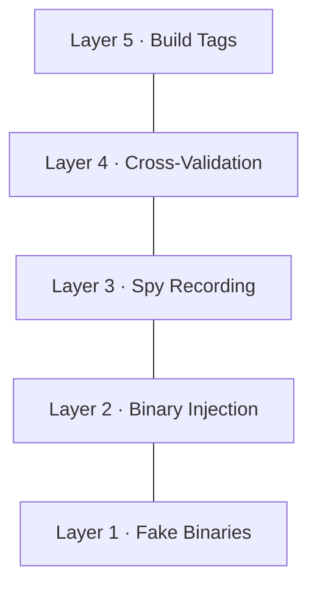
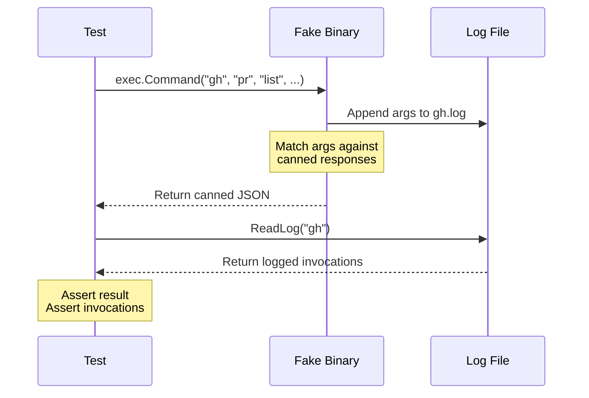
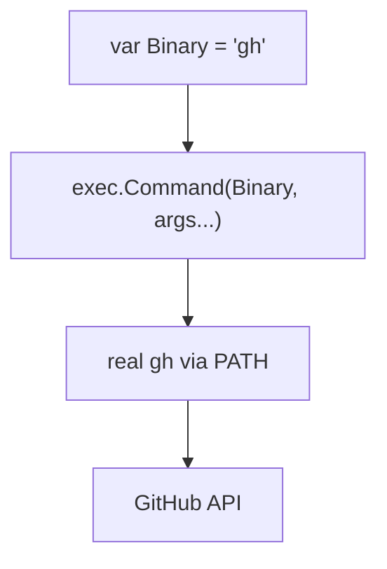
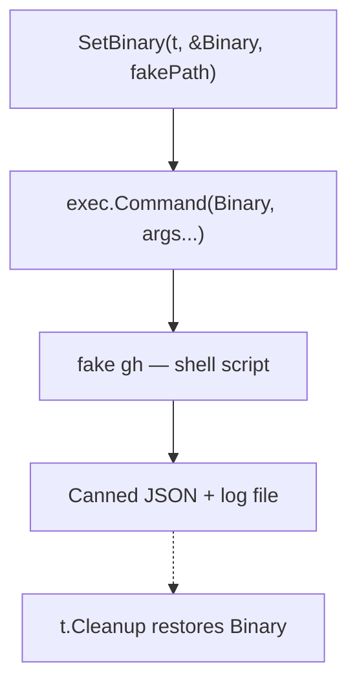
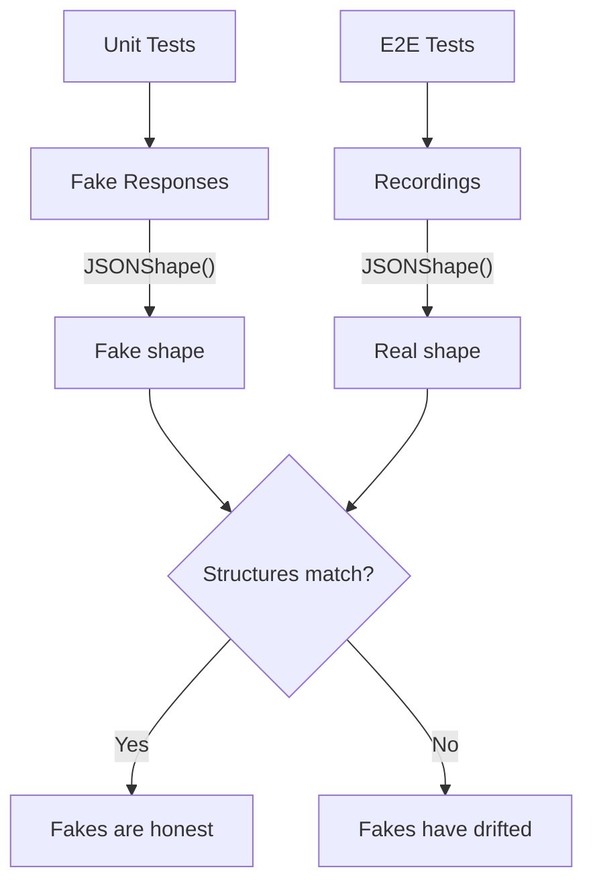
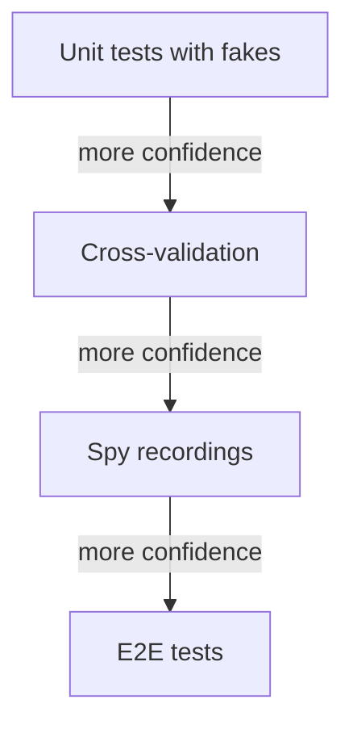

Your CLI tool doesn't do anything on its own. It orchestrates other tools — `git`, `gh`, `curl`, `docker`, whatever your domain demands. The real logic lives in the sequencing: call A, parse the output, decide what to call next, handle failures gracefully.

This is the reality of building developer tools. And it creates a testing problem that most guides skip over: **how do you test code whose primary job is to shell out to external binaries?**

This post walks through the testing strategy we built for [SDF](https://github.com/pavelpascari/sdf), a CLI tool that manages stacked pull requests on GitHub. SDF delegates everything to `git` and `gh` (the GitHub CLI) — it doesn't implement its own Git client or GitHub API client. That design keeps the tool simple and trustworthy, but it means every interesting code path involves spawning a subprocess.

We went from "run it manually and see if it works" to a system where our fakes are provably honest — where we can demonstrate, in CI, that our test doubles produce structurally compatible output to the real tools. Here's how we got there, and what we learned along the way.



## The problem, concretely

Consider a function that syncs a stack of PRs. In pseudocode:

```
prs = gh pr list --state all --json ...
for each branch in stack:
    if pr is merged:
        gh pr edit <downstream> --base <new-parent>
    else if branch is stale:
        git rebase --onto <parent> <old-base> <branch>
        git push --force-with-lease origin <branch>
```

Every line that starts with `git` or `gh` spawns a real process. The function's correctness depends on:

1. Calling the right commands with the right arguments
2. Parsing their output correctly (JSON from `gh`, exit codes from `git`)
3. Handling errors (authentication failures, merge conflicts, network issues)
4. Sequencing operations correctly (don't push before rebase finishes)

You can't unit test this by calling the function in a test — it would rebase your actual branches and edit your actual PRs. You need to intercept the subprocess calls. But how?

## Layer 1: Fake binaries

The most direct approach: create actual executables that pretend to be `git` or `gh`. Not mocks in the Go sense — real shell scripts on disk that your code can `exec.Command()` against.

Here's the idea. You write a shell script that:
- Logs every invocation to a file (so you can assert what was called)
- Returns canned responses based on the arguments it receives
- Always exits 0 (or 1, for error-path testing)

```go
func FakeBin(t *testing.T, dir, name string, responses map[string]string) string {
    binPath := filepath.Join(dir, name)
    logPath := filepath.Join(dir, name+".log")

    // Build case branches for argument matching
    var cases strings.Builder
    for prefix, output := range responses {
        escaped := strings.ReplaceAll(output, "'", "'\\''")
        cases.WriteString(fmt.Sprintf(
            "  *\"%s\"*)\n    cat <<'FAKEEOF'\n%s\nFAKEEOF\n    ;;\n",
            prefix, escaped,
        ))
    }

    script := fmt.Sprintf(`#!/bin/sh
ARGS="$*"
echo "$ARGS" >> '%s'
case "$ARGS" in
%s  *)
    ;;
esac
exit 0
`, logPath, cases.String())

    os.WriteFile(binPath, []byte(script), 0755)
    return binPath
}
```

The response map is keyed by argument prefix. When the fake `gh` receives `pr list --state all --json ...`, it pattern-matches against `"pr list"` and returns the canned JSON. When it receives something unexpected, it succeeds silently — just like a well-behaved Unix tool.

For error paths, there's a companion:

```go
func FakeBinFail(t *testing.T, dir, name, stderr string) string {
    // Creates a script that logs the call, prints to stderr, exits 1
}
```

Why shell scripts instead of Go mocks? Because your production code uses `exec.Command()`. It doesn't call a Go interface — it spawns a process. The fake needs to *be* a process. Shell scripts are the simplest thing that satisfies this constraint.

Here's the flow at test time:



## Layer 2: Binary injection

Creating a fake binary is only half the problem. Your production code needs to *use* it instead of the real `git` or `gh`. This is where a small design decision pays off hugely.

Each wrapper package exposes a single variable:

```go
// internal/gh/gh.go
var Binary = "gh"

func run(args ...string) (string, error) {
    cmd := exec.Command(Binary, args...)
    out, err := cmd.CombinedOutput()
    // ...
}
```

In production, `Binary` is `"gh"` and `exec.Command` resolves it via `PATH`. In tests, you point it at your fake:

```go
func SetBinary(t *testing.T, target *string, fakePath string) {
    t.Helper()
    orig := *target
    *target = fakePath
    t.Cleanup(func() { *target = orig })
}
```

The `t.Cleanup` is critical — it restores the original value after the test, even if the test panics. Without it, one test's fake would leak into the next.

**In production**, `Binary` resolves to the real tool via `PATH`:



**In tests**, you swap it for a fake and restore it afterward:



Here's what a real test looks like with these two pieces combined:

```go
func TestReconcileSyncPRStates_FillsFromGitHub(t *testing.T) {
    syncTestRepo(t) // sets up a temp git repo with branches

    dir := t.TempDir()
    fake := testutil.GHFakeBinWith(t, dir, map[string]string{
        "pr list": `[
            {"number":10,"headRefName":"branchA","state":"OPEN","baseRefName":"main","url":"https://github.com/test/pull/10"},
            {"number":11,"headRefName":"branchB","state":"OPEN","baseRefName":"branchA","url":"https://github.com/test/pull/11"},
            {"number":12,"headRefName":"branchC","state":"OPEN","baseRefName":"branchB","url":"https://github.com/test/pull/12"}
        ]`,
    })
    testutil.SetBinary(t, &ghpkg.Binary, fake)

    s, err := stack.Load(".")
    if err != nil {
        t.Fatal(err)
    }
    reconcileSyncPRStates(s)

    // Assert PRs were filled from the fake response
    expected := map[string]int{
        "branchA": 10, "branchB": 11, "branchC": 12,
    }
    for _, node := range s.Nodes {
        if want, ok := expected[node.Branch]; ok && node.PR != want {
            t.Errorf("expected PR #%d for %s, got #%d", want, node.Branch, node.PR)
        }
    }

    // Assert gh was actually called
    log := testutil.ReadLog(t, dir, "gh")
    if len(log) != 1 {
        t.Fatalf("expected 1 gh invocation, got %d", len(log))
    }
}
```

Notice the dual assertion: we check both the *result* (PRs were filled correctly) and the *interaction* (gh was called exactly once). The `ReadLog` function reads the invocation log that the fake binary wrote to disk.

You can also test the case where a tool is completely unavailable:

```go
testutil.SetBinary(t, &ghpkg.Binary, "/nonexistent/gh")
```

This simulates a user who doesn't have `gh` installed. The `exec.LookPath` check fails, and your code should degrade gracefully — no PR operations, but git operations still work.

## What these two layers buy you

With fake binaries and binary injection, you can test:

- **Happy paths**: correct argument construction, JSON parsing, state updates
- **Error paths**: binary not found, authentication failures, malformed output
- **Sequencing**: verify invocations happened in the right order via the log file
- **Isolation**: each test gets its own temp directory and cleanup

This is enough for most CLI tools. If your external dependencies are stable and their output format doesn't change often, fake binaries give you fast, deterministic, self-contained tests.

But there's a problem hiding under the surface.

## The honest-fakes problem

Fake binaries have a flaw: **they rot**. Over time, the real tool's output format changes — a field is renamed, a new field appears, the JSON structure shifts from an object to an array — and your fakes keep returning the old format. Your tests pass. Your code breaks in production.

This is the fundamental tension: fakes are useful *because* they're simple and controlled, but they're dangerous *because* they're simple and controlled. They don't evolve with the real tool.

You could periodically update your fakes by hand, but that's error-prone and doesn't scale. What you really want is a way to **prove that your fakes match reality**.

## Layer 3: Spy recording

The first step toward honest fakes is capturing what the real tools actually return. We built a spy recorder — a simple JSONL logger that records every invocation of an external binary.

```go
type Invocation struct {
    Actor     string   `json:"actor"`
    Binary    string   `json:"binary"`
    Args      []string `json:"args"`
    Stdout    string   `json:"stdout"`
    ExitCode  int      `json:"exit_code"`
    Timestamp string   `json:"timestamp"`
}

type Recorder struct {
    mu     sync.Mutex
    file   *os.File
    name   string
    binary string
}
```

The recorder is thread-safe (mutex-protected), nil-safe (all methods are no-ops on a nil receiver), and writes one JSON object per line. It captures *everything*: what was called, with what arguments, what came back, and whether it succeeded.

In each wrapper package, the `run()` function calls `recordRun()` after every command execution:

```go
func run(args ...string) (string, error) {
    cmd := exec.Command(Binary, args...)
    out, err := cmd.CombinedOutput()
    output := strings.TrimSpace(string(out))

    exitCode := 0
    if err != nil {
        exitCode = 1
    }
    recordRun(args, output, exitCode)

    if err != nil {
        return output, fmt.Errorf("gh %s: %s", strings.Join(args, " "), output)
    }
    return output, nil
}
```

The recording infrastructure distinguishes between two actors:

- **`"sdf"`** — the tool's own internal calls (when sdf calls `git rebase` or `gh pr list`)
- **`"testing"`** — the test harness's calls (when a test helper runs `git commit` to set up a fixture)

This distinction matters because a single E2E test run interleaves both: the test sets up a git repo (testing actor), then runs `sdf sync` (sdf actor), then verifies the result (testing actor again). The combined `full.jsonl` log preserves the complete interleaved sequence, while per-tool logs (`git_sdf.jsonl`, `gh_testing.jsonl`) let you focus on one perspective.

```
  E2E Test Timeline                          Recorded To
  ──────────────────                         ───────────

  ▼ Test setup
  │  git init                        ──────► git_testing.jsonl
  │  git commit -m "initial"         ──────► git_testing.jsonl
  │  git checkout -b feature-a       ──────► git_testing.jsonl     ──┐
  │                                                                  │
  ▼ sdf sync                                                         │
  │  git log --oneline main..HEAD    ──────► git_sdf.jsonl           ├──► full.jsonl
  │  gh pr list --json ...           ──────► gh_sdf.jsonl            │    (interleaved)
  │  git rebase --onto main ...      ──────► git_sdf.jsonl           │
  │  git push --force-with-lease     ──────► git_sdf.jsonl           │
  │                                                                  │
  ▼ Test verification                                                │
  │  git log --oneline               ──────► git_testing.jsonl     ──┘
  │
  ▼ Done
```

After an E2E run, you get a directory like this:

```
e2e/testdata/recordings/<run-id>/TestE2E_FullLifecycle/
    sdf_testing.jsonl      # sdf commands run by the test
    git_sdf.jsonl          # git commands run by sdf internally
    gh_sdf.jsonl           # gh commands run by sdf internally
    git_testing.jsonl      # git commands run by test setup
    full.jsonl             # everything, interleaved, in order
```

These recordings are the ground truth. They capture exactly what `gh pr list` returned from the real GitHub API, with real PR numbers and real branch names. They're the raw material for the next layer.

## Layer 4: Cross-validation

Here's where it comes together. We have recordings of real API responses. We have fake binaries that return canned responses. The question is: **do they match?**



The bridge is a function that converts recordings into fake responses:

```go
func RecordingsToFakeResponses(invocations []Invocation) map[string]string {
    responses := make(map[string]string)
    for _, inv := range invocations {
        if inv.ExitCode != 0 {
            continue // skip failures
        }
        key := strings.Join(inv.Args, " ")
        if _, exists := responses[key]; !exists {
            responses[key] = inv.Stdout // first recording wins
        }
    }
    return responses
}
```

And a validator that checks structural compatibility:

```go
func ValidateFakeAgainstRecordings(
    t *testing.T,
    fakeResponses map[string]string,
    recordings []Invocation,
) {
    for _, inv := range recordings {
        if inv.ExitCode != 0 {
            continue
        }
        key := strings.Join(inv.Args, " ")
        fakeResponse, exists := fakeResponses[key]
        if !exists {
            t.Errorf("no fake response for %q", key)
            continue
        }
        if IsJSON(inv.Stdout) && IsJSON(fakeResponse) {
            realShape := JSONShape(inv.Stdout)
            fakeShape := JSONShape(fakeResponse)
            if realShape != fakeShape {
                t.Errorf("JSON structure mismatch for %q:\n  real: %s\n  fake: %s",
                    key, realShape, fakeShape)
            }
        }
    }
}
```

The key insight is **structural comparison, not value comparison**. We don't care that the real API returned PR #847 and the fake returns PR #10. We care that both return `array[object{baseRefName,headRefName,number,state,url}]`. Same keys, same nesting, same types.

`JSONShape` recursively describes the structure:

```go
func JSONShape(s string) string {
    s = strings.TrimSpace(s)
    if len(s) == 0 {
        return "empty"
    }
    if s[0] == '[' {
        var arr []json.RawMessage
        json.Unmarshal([]byte(s), &arr)
        if len(arr) == 0 {
            return "array[]"
        }
        return fmt.Sprintf("array[%s]", JSONShape(string(arr[0])))
    }
    if s[0] == '{' {
        var obj map[string]json.RawMessage
        json.Unmarshal([]byte(s), &obj)
        keys := make([]string, 0, len(obj))
        for k := range obj {
            keys = append(keys, k)
        }
        sort.Strings(keys)
        return fmt.Sprintf("object{%s}", strings.Join(keys, ","))
    }
    return "scalar"
}
```

When this test fails, it means one of two things:

1. **GitHub changed their API** — your fakes need updating, and you know exactly which field changed
2. **Your fakes were always wrong** — they had the wrong structure from the start, and your unit tests were testing against fiction

Either way, the failure is the system working correctly. It caught a drift that would otherwise have been invisible.

## Layer 5: Build tags

There's one more problem. The spy recording infrastructure — the `Recorder`, the JSONL writing, the `init()` function that checks the `SDF_SPY_DIR` environment variable — all of that was living in the production code. Every wrapper package imported the spy package. Every command execution checked if a recorder was configured.

This is harmless at runtime (nil checks are cheap), but it's conceptually wrong. Production users never record invocations. The spy infrastructure is test scaffolding that leaked into the shipped binary.

Go's build tags solve this cleanly. For each wrapper package, we created two files:

```go
//go:build !spyrecord

package git

// No-op in production builds. Compiler inlines this to nothing.
func recordRun(args []string, output string, exitCode int) {}
```

```go
//go:build spyrecord

package git

import (
    "os"

    "github.com/pavelpascari/sdf/internal/spy"
)

var spyRec *spy.Recorder
var fullSpy *spy.Recorder

func init() {
    if dir := os.Getenv("SDF_SPY_DIR"); dir != "" {
        spyRec = spy.NewRecorderFor(dir, "sdf", "git")
        fullSpy = spy.NewRecorder(dir, "full")
    }
}

func recordRun(args []string, output string, exitCode int) {
    if spyRec != nil {
        spyRec.Record(args, output, exitCode)
        fullSpy.RecordAs("sdf", "git", args, output, exitCode)
    }
}
```

The production `run()` function calls `recordRun()` unconditionally. In a normal build, the compiler sees an empty function body and optimizes it away completely — zero runtime cost. When built with `-tags spyrecord`, the real recording kicks in.

```
  Source Files                       Compiled Binary
  ────────────                       ───────────────

  record_noop.go                     go build (default)
  ┌──────────────────────┐           ┌───────────────────────┐
  │ //go:build !spyrecord│    ──►    │  recordRun() { }      │
  │ func recordRun() {}  │           │  ← inlined to nothing │
  └──────────────────────┘           │                       │
                                     │  No spy imports.      │
  record_spy.go                      │  No JSONL writing.    │
  ┌──────────────────────┐           │  Zero overhead.       │
  │ //go:build spyrecord │           └───────────────────────┘
  │ import "spy"         │
  │ func recordRun() {   │           go build -tags spyrecord
  │   spyRec.Record(...) │           ┌───────────────────────┐
  │ }                    │    ──►    │  recordRun() {        │
  └──────────────────────┘           │    spyRec.Record(...) │
                                     │  }                    │
  Only ONE file is                   │                       │
  compiled per build.                │  Writes to JSONL.     │
                                     │  Full recording.      │
                                     └───────────────────────┘
```

```makefile
# Production build — no spy code compiled
make build

# E2E test build — spy recording enabled
make build-spy    # go build -tags spyrecord ...
```

This is the Go-idiomatic way to handle conditional compilation. No interface indirection, no runtime feature flags, no dependency injection framework. Just two files that provide the same function signature, selected at compile time.

## How the layers compose

Each layer addresses a different failure mode:

| Layer | What it catches | Cost |
|-------|----------------|------|
| **Fake binaries** | Wrong argument construction, broken JSON parsing, missing error handling | A shell script per tool |
| **Binary injection** | Tests that accidentally use real tools, cleanup failures between tests | One `var Binary` per package |
| **Spy recording** | "What does the real API actually return?" — captures ground truth | A JSONL recorder |
| **Cross-validation** | Fake drift — when your test doubles stop matching reality | A shape comparator |
| **Build tags** | Test infrastructure leaking into production | Two files per package |

The layers are also independent. You can use fake binaries without spy recording. You can use spy recording without cross-validation. Each layer is useful on its own, and they compose naturally when you need more confidence.

## What we learned

**Fake binaries are underrated.** Most discussions about testing CLI tools jump straight to Go interfaces and mock libraries. But when your code calls `exec.Command()`, the simplest and most honest test double is another executable. Shell scripts are fast to create, easy to debug (they're just text files), and they test the actual `exec.Command` path — including argument escaping, environment variables, and exit codes.

**Invocation logs are better than mock assertions.** Instead of asserting "this mock was called with these arguments," we write calls to a log file and read it back. This is simpler, more debuggable (you can `cat` the log), and works across process boundaries. When sdf spawns a subprocess that spawns another subprocess, the invocation log captures the full chain.

**Structural comparison is the right granularity.** Comparing JSON values makes tests brittle (PR numbers change, timestamps change, URLs change). Comparing JSON shapes catches the errors that actually matter: a field was renamed, an array became an object, a required key disappeared. It's the sweet spot between "no comparison" and "exact match."

**Build tags for test infrastructure.** If your test scaffolding imports packages that production code doesn't need, build tags are cleaner than runtime checks. The compiler eliminates dead code completely — not "probably optimized away" but "literally not in the binary." This matters for tools that ship as standalone executables.

**Record real interactions, then build fakes from them.** The `RecordingsToFakeResponses` function embodies this principle. Don't guess what the API returns — record it, then use the recording as the source of truth for your fakes. When the API changes, your recordings change, your fakes update, and your unit tests stay honest.

## The trust gradient

The testing strategy for a CLI tool that shells out is fundamentally about building a gradient of trust:

- **Unit tests with fakes** give you fast feedback on logic. They run in milliseconds, need no network, and catch most regressions.
- **Spy recordings** give you a snapshot of reality. They capture what the real tools actually return, preserving the ground truth.
- **Cross-validation** bridges the two. It proves that your fast, fake-based tests are testing against realistic data.
- **E2E tests** give you end-to-end confidence. They run against real GitHub repos, create real PRs, and verify the full workflow.

Each layer is more expensive and slower than the last. You run unit tests on every save. You run E2E tests in CI. You cross-validate periodically to keep fakes honest. The trust gradient lets you move fast *and* be confident.



The code for all of this is open source in the [SDF repository](https://github.com/pavelpascari/sdf). The testing infrastructure lives in `internal/spy/`, `internal/testutil/`, and `e2e/`. If you're building a CLI tool that shells out to external binaries, feel free to steal the pattern.
